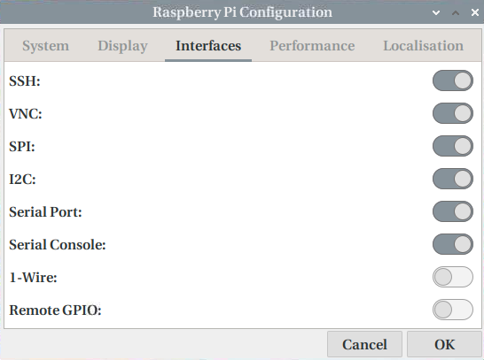
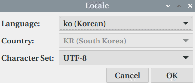
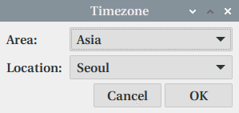
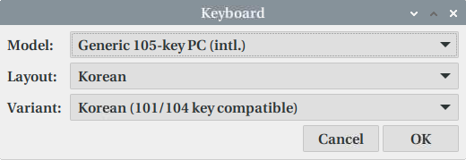
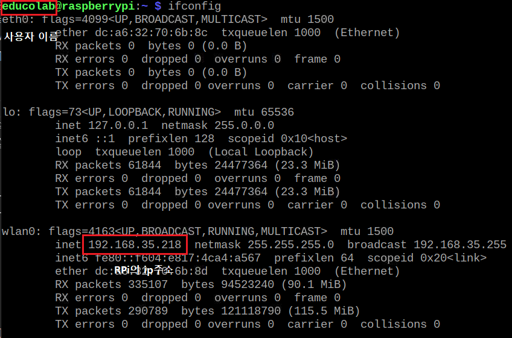
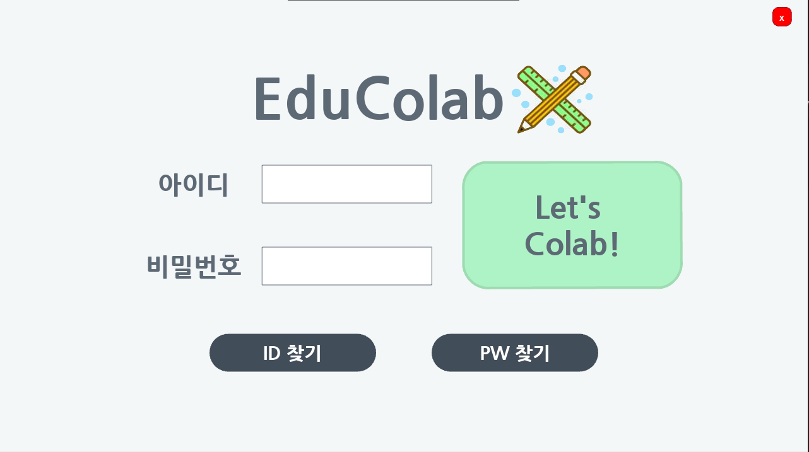

# 임베디드 화면 연결 및 테스트

-   **Try_all_v0** : 로그인 화면 + ID/PW 찾기 화면 연결. 모듈로 구성. <br>
    `main.py`를 실행하여 전체 화면 연결을 테스트하거나, 개별 .py를 실행하여 구성화면을 테스트할 수 있음.<br>
-   **Try_package_v0** : 로그인 화면 + ID/PW 찾기 화면 연결. 패키지로 구성. 미완성<br>
-   **Try_all_v1** : 화면 이동 제한 및 팝업 + 로그인 및 찾기 기능 <br>
-   **Try_all_v1_backup** : 프론트 기능만 업데이트 된 버전<br>
-   **Try_all_v2_backup** : v1 + 프론트(시작화면 로딩, DB 추가, 가상키보드 기능)<br>
    <br>
-   **notice_v0** : 공지사항 목록 및 상세 화면 디자인<br>
-   **Try_all_v3** : v2_backup + 로그인 토큰 저장 기능<br>
-   **Try_all_v3_backup** : v3 + 공지사항 목록 화면 추가<br>
-   **Try_all_v4** : v3_backup + 메인페이지 업데이트 기능 추가 <br>
-   **Try_all_v4_backup** : v4 + 공지사항 상세 페이지 추가<br>
-   **Try_all_v5** : v4_backup + 공지사항 목록 및 상세내용 보기 기능 추가 <br>
-   **Try_all_v5_backup** : v5 + 설문조사 화면 추가<br>
-   **Try_all_v6** : v5_backup + 설문조사 기능 추가<br>
-   **Try_all_v6_backup** : v6 + 퀴즈 화면 추가<br>
-   **Try_all_v7** : v6_backup + 설문조사 상세페이지 추가<br>
-   **Try_all_v8** : v7 + quiz 구현 및 칭호 변경 + 프로필 사진 추가<br>
    <br>

# 개요

> 본 내용은 educolab embedded 분야의 포팅매뉴얼을 기술한다.  
> 학생용 스마트기기 서비스의 일종으로 크로스플랫폼 사용자 인터페이스의 오픈소스 파이썬 라이브러리인 kivy를 이용하여 본 서비스를 제작하였다.  
> Raspberry Pi(이하 RPi)를 기준으로 기술한다.

<br>
<br>

# Kivy 설치하기

-   ## RPi 초기 세팅

    한국 학교를 기준으로 서비스를 만들었기에 한글 입력을 위한 설정이 필요하다  
     먼저 `기본 설정 -> Raspberry Pi Configuration -> interfaces`에서 다음과 같이 세팅한다.<br><br>
    

      <br>

    같은 곳의 `Localisation`에서 `Locale, Timezone, Keyboard, WiFi Country`는 다음과 같이 세팅한다.(WiFi Country는 상황에 따라 다름)<br><br>
    <br>

    <br>

    <br>

    이를 수행한 뒤 RPi의 WiFi 연결까지 모두 완료하였다면, RPi를 재부팅 후 Windows Terminal ssh로 접근하는 것을 권장한다(Microsoft Store에 검색해보자).  
    Windows Terminal에 `ssh [사용자이름]@[RPi의 ip주소]`로 접속한다.  
    ip 주소와 사용자 이름은 RPi의 이 화면을 참고한다<br><br>
    <br>

    ssh에 접속했다면, 다음의 명령어를 순차적으로 수행하여 패키지를 설치한다.<br>

    ```sh
    sudo apt-get update
    sudo apt-get upgrade -y
    sudo apt install fonts-nanum fcitx fcitx-hangul -y
    ```

      <br>

    완료되었다면 `sudo vi /etc/default/im-config`에서 `IM_CONFIG_DEFAULT_MODE=fcitx`로 수정한 후 저장한다.  
     그리고 `기본 설정 -> 입력기(Input Method)`로 가서 계속 확인 누르다가 중간에 `default` 선택하고 계속 확인을 누른다.  
     끝났다면 `sudo reboot`로 재부팅하면 한글이 적용될 것이다.  
     한/영 키로 한글 영어 전환하고 싶으면 `(작업 표시줄의 키보드 모양 우클릭) -> 설정 -> 전역 설정 -> 입력키 변환`에서 설정하면 된다.

-   ## Python 가상환경 및 Kivy 설치

    먼저 다음의 명령어로 apt package를 설치하고 pip를 설치한다.<br>

    ```sh
    sudo apt install python3-setuptools git-core python3-dev -y
    sudo apt install pkg-config libgl1-mesa-dev libgles2-mesa-dev \
        libgstreamer1.0-dev \
        gstreamer1.0-plugins-{bad,base,good,ugly} \
        gstreamer1.0-{omx,alsa} libmtdev-dev \
        xclip xsel libjpeg-dev -y
    sudo apt-get install python3-pygame python3-opengl build-essential python3-pip \
        libsdl2-dev libsdl2-image-dev libsdl2-mixer-dev libsdl2-ttf-dev
    sudo pip install --upgrade pip setuptools virtualenv
    ```

    <br>

    그리고 Python 명령어를 Python3 버전으로 기본값 설정을 위해 다음과 같은 명령어를 수행한다.

    ```sh
    sudo ln -sf /usr/bin/python3 /usr/bin/python
    ```

    <br>

    Python 가상환경을 생성한 후 가상환경으로 진입하자.

    ```sh
    cd ~/Documents
    virtualenv venv
    source ./venv/bin/activate
    ```

    <br>

    본 프로젝트를 다운로드했다면(git clone 등) pip를 설치한 후 kivy를 실행하자.

    ```sh
    cd ./embedded
    pip install -r requirements.txt
    deactivate
    source run_app.sh
    ```

    <br>

    만약 이와 같은 화면이 나온다면 성공한 것이다.<br>

    <br>

    <br>

# 그 외...

-   ## 포트포워딩과 보안(포드포워딩 부분을 다듬은 뒤에 보안(fail2ban) 작성하자)

    ipTime, SK broadband, LG Uplus, KT 공유기 등 공유기 별로 포트포워딩 방법이 다르니 이에 맞춰서 포트포워딩 한다.  
    ssh의 경우 내부 포트는 22, vnc의 경우는 5900이다.  
    외부 포트는 아무 포트로 설정 가능하지만, 되도록 10000 이상으로 설정하고, ssh와 vnc의 외부 포트는 다르게 설정하자.  
    ip 주소는 RPi의 ip 주소를 설정하면 된다.  
    이를 설정하는 이유는 백엔드 포팅매뉴얼에서도 알려 주겠지만 공유기의 public ip 주소를 server의 whitelist에 추가하기 위해 필요하다.  
    이를 모두 설정해 주면 본인 집 뿐만 아니라 다른 지역에서도 본인 집에 있는 RPi로 접근할 수 있다. 즉, 작은 server가 생성된다는 뜻!  
    ssh로 접근하는 방법은 `ssh [사용자이름]@[공유기의 public ip 주소] -p [외부 포트 번호]`이고, vnc는 `[공유기의 public ip 주소]:[외부 포트 번호]`로 진입한다.

    <br>

-   ## kivy 한글 글꼴 설정
    kivy에서는 한글 입력 및 출력이 가능하지만, 한글 글꼴을 세팅하지 않으면 입/출력 모두 정상적으로 나타나지 않고 깨진다.  <br>
    따라서 다음과 같은 방법으로 한글 글꼴을 베이스로 세팅하고 프로그램을 실행하는 것이 이상적이다.
    해당 프로그램에서 개발 과정에서 사용된 글꼴을 베이스로 예시를 작성하였다.

    1. 구글 폰트에서 글꼴 다운로드 <br>
    구글폰트(`https://fonts.google.com/`)에서 원하는 한글 폰트를 찾는다. <br>
    나눔고딕(Nanum Gothic)을 선택하고, 우측 상단의 Download family 버튼을 선택하여 폰트를 다운로드한다. <br>
    2. 폰트 파일 경로 설정<br> 
    kivy 사용시 실행하는 파일(main.py)를 기준으로 폰트의 경로를 설정한다. <br>
    해당 파일을 기준으로 `data` 폴더를 생성하고, data 폴더 내부에 `fonts` 폴더를 생성한다.<br>
    다운로드 받은 폰트의 압축을 풀어 `fonts` 폴더에 저장한다. <br>
    1. kivy default 설정 파일 변경<br>
    `home` 경로에서 `.kivy` 폴더로 이동한다. <br>
    Windows 10 기준 `C:\Users\(사용자이름)\.kivy` 혹은 라즈베리 파이 기준 `~/.kivy` 경로로 이동<br>
    내부의 `config.ini` 파일을 열어 `default_font` 속성을 찾은 뒤 다음과 같이 수정한다.<br>


        ``` python
        # default_font = [폰트 이름, 기본 글꼴 경로, italic 글꼴 경로, bold 글꼴 경로, italic-bold 글꼴 경로]
        default_font = ['Nanum', 'data/fonts/NanumGothic-Regular.ttf', 'data/fonts/NanumGothic-Bold.ttf', 'data/fonts/NanumGothic-ExtraBold.ttf']
        ```
    <br>

# Embedded 기술 스택

-   ### Raspberry Pi
    > HW : Raspberry Pi 4 Model B Rev 1.2  
    > SW : Raspbian GNU/Linux 11 (bullseye)
-   ### Python: 3.9.2
-   ### Kivy : 2.1.0
-   ### websocket-client : 1.3.3
-   ### mysql-connector-python: 8.0.30
-   ### requests: 2.28.1
